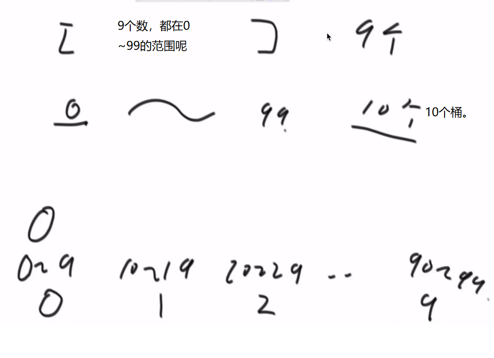

# <center>03.算法-算法的稳定性，综合排序算法，比较器，桶排序，数组实现栈、队列，栈队列互实现<center>

# 1.排序算法的稳定性及其汇总

稳定排序概念：`通俗地讲就是能保证排序前两个相等的数其在序列的前后位置顺序和排序后它们两个的前后位置顺序相同。在简单形式化一下，如果Ai = Aj，Ai原来在位置前，排序后Ai还是要在Aj位置前。`

代表：
- 稳定排序：`冒泡`、`插入`、`归并` 
- 不稳定排序：`选择`、`希尔`、`快速排序(可以做到稳定但是比较难)`、`堆排序`


# 2.工程中的综合排序算法

1. 待排序数组较长，如果待排序数据类型为`基本数据类型（如int, long, float, char等），选择快排`，
因为基础类型无需区分原始顺序；否则待`排数据类型为自定义类型时，选择归并排序`，因为自定义类型可能需要区分原始顺序（如考试成绩表中的Student对象）。

2. `待排序数组较短（数组长度小于60），选择插入排序`，因为待排元素较少的情况下，插入排序时间复杂度劣势不明显，但其使用较少的常数项使得其在小样本量的情况中有较快的性能。

所以一般情况下，项目中先采用分治的思想处理，最后发现元素数量小于60时，再采用插入排序


# 3.排序问题的补充

1. 归并排序的额外空间复杂度可以变成O(1)，但是非常难，不需要掌握，可以搜“归并排序 内部缓存法”
2. 快速排序可以做到稳定性问题，但是非常难，不需要掌握，可以搜“01 stable sort”
3. 有一道题目，是奇数放在数组左边，偶数放在数组右边，还要求原始的相对次序不变，碰到这个问题，可以怼面试官。面试官非良人。

# 4.比较器的使用

```java
public class Code_09_Comparator {

	public static class Student {
		public String name;
		public int id;
		public int age;

		public Student(String name, int id, int age) {
			this.name = name;
			this.id = id;
			this.age = age;
		}
	}

	public static class IdAscendingComparator implements Comparator<Student> {

		@Override
		public int compare(Student o1, Student o2) {
			return o1.id - o2.id; // 升序
		}

	}

	public static class IdDescendingComparator implements Comparator<Student> {

		@Override
		public int compare(Student o1, Student o2) {
			return o2.id - o1.id; // 降序
		}

	}

	public static void printStudents(Student[] students) {
		for (Student student : students) {
			System.out.println("Name : " + student.name + ", Id : " + student.id + ", Age : " + student.age);
		}
		System.out.println("===========================");
	}

	public static void main(String[] args) {
		Student student1 = new Student("A", 1, 23);
		Student student2 = new Student("B", 2, 21);
		Student student3 = new Student("C", 3, 22);

		Arrays.sort(students, new IdAscendingComparator());
		printStudents(students);

		Arrays.sort(students, new IdDescendingComparator());
		printStudents(students);
	}

}
```

# 5.桶排序、计数排序、基数排序的介绍



定义：非基于比较的排序，与被排序的样本的实际数据状况很有关系，所以实际中并不经常使用。

- 思想：`将集合(个数N)中所有元素按照大小分别放于N+1个桶中，然后从第一个桶开始遍历完成后就是有序的集合了`
- 时间复杂度：`O(N)`
- 空间复杂度：`O(N)`
- 稳定性排序

```java
public class Code_06_BucketSort {

	// only for 0~200 value
	public static void bucketSort(int[] arr) {
		if (arr == null || arr.length < 2) {
			return;
		}
		int max = Integer.MIN_VALUE;
		for (int i = 0; i < arr.length; i++) {
			max = Math.max(max, arr[i]);
		}
		int[] bucket = new int[max + 1];
		for (int i = 0; i < arr.length; i++) {
			bucket[arr[i]]++;
		}
		int i = 0;
		for (int j = 0; j < bucket.length; j++) {
			while (bucket[j]-- > 0) {
				arr[i++] = j;
			}
		}
	}
}
```

# 6.题目：桶排序

给定一个数组，求如果排序之后，相邻两数的最大差值，要求时间复杂度O(N)，且要求不能用`非基于比较的排序`。

```java
public class Code_11_MaxGap {

	public static int maxGap(int[] nums) {
		if (nums == null || nums.length < 2) {
			return 0;
		}
		int len = nums.length;
		int min = Integer.MAX_VALUE;
		int max = Integer.MIN_VALUE;
		for (int i = 0; i < len; i++) {
			min = Math.min(min, nums[i]);
			max = Math.max(max, nums[i]);
		}
		if (min == max) {
			return 0;
		}
		boolean[] hasNum = new boolean[len + 1];
		int[] maxs = new int[len + 1];
		int[] mins = new int[len + 1];
		int bid = 0;
		for (int i = 0; i < len; i++) {
			bid = bucket(nums[i], len, min, max);
			mins[bid] = hasNum[bid] ? Math.min(mins[bid], nums[i]) : nums[i];
			maxs[bid] = hasNum[bid] ? Math.max(maxs[bid], nums[i]) : nums[i];
			hasNum[bid] = true;
		}
		int res = 0;
		int lastMax = maxs[0];
		int i = 1;
		for (; i <= len; i++) {
			if (hasNum[i]) {
				res = Math.max(res, mins[i] - lastMax);
				lastMax = maxs[i];
			}
		}
		return res;
	}

	public static int bucket(long num, long len, long min, long max) {
		return (int) ((num - min) * len / (max - min));
	}
}
```

# 7.题目：数组结构实现大小固定的队列和栈

```java
public class Code_01_Array_To_Stack_Queue {

	public static class ArrayStack {
		private Integer[] arr;
		private Integer size;

		public ArrayStack(int initSize) {
			if (initSize < 0) {
				throw new IllegalArgumentException("The init size is less than 0");
			}
			arr = new Integer[initSize];
			size = 0;
		}

		public Integer peek() {
			if (size == 0) {
				return null;
			}
			return arr[size - 1];
		}

		public void push(int obj) {
			if (size == arr.length) {
				throw new ArrayIndexOutOfBoundsException("The queue is full");
			}
			arr[size++] = obj;
		}

		public Integer pop() {
			if (size == 0) {
				throw new ArrayIndexOutOfBoundsException("The queue is empty");
			}
			return arr[--size];
		}
	}

	public static class ArrayQueue {
		private Integer[] arr;
		private Integer size;
		private Integer first;
		private Integer last;

		public ArrayQueue(int initSize) {
			if (initSize < 0) {
				throw new IllegalArgumentException("The init size is less than 0");
			}
			arr = new Integer[initSize];
			size = 0;
			first = 0;
			last = 0;
		}

		public Integer peek() {
			if (size == 0) {
				return null;
			}
			return arr[first];
		}

		public void push(int obj) {
			if (size == arr.length) {
				throw new ArrayIndexOutOfBoundsException("The queue is full");
			}
			size++;
			arr[last] = obj;
			last = last == arr.length - 1 ? 0 : last + 1;
		}

		public Integer poll() {
			if (size == 0) {
				throw new ArrayIndexOutOfBoundsException("The queue is empty");
			}
			size--;
			int tmp = first;
			first = first == arr.length - 1 ? 0 : first + 1;
			return arr[tmp];
		}
	}
}
```

# 8.题目：实现一个特殊的栈

实现一个特殊的栈，在实现栈的基本功能的基础上，再实现返回栈中最小元素的操作。

【要求】  
1. pop、push、getMin操作的时间复杂度都是O(1)。
2. 设计的栈类型可以使用现成的栈结构

```java
public class Code_02_GetMinStack {
	public static class MyStack1 {
		private Stack<Integer> stackData;
		private Stack<Integer> stackMin;

		public MyStack1() {
			this.stackData = new Stack<Integer>();
			this.stackMin = new Stack<Integer>();
		}

		public void push(int newNum) {
			if (this.stackMin.isEmpty()) {
				this.stackMin.push(newNum);
			} else if (newNum <= this.getmin()) {
				this.stackMin.push(newNum);
			}
			this.stackData.push(newNum);
		}

		public int pop() {
			if (this.stackData.isEmpty()) {
				throw new RuntimeException("Your stack is empty.");
			}
			int value = this.stackData.pop();
			if (value == this.getmin()) {
				this.stackMin.pop();
			}
			return value;
		}

		public int getmin() {
			if (this.stackMin.isEmpty()) {
				throw new RuntimeException("Your stack is empty.");
			}
			return this.stackMin.peek();
		}
	}
}
```

# 9.题目：队列实现栈，栈实现队列

```java
	public static class TwoStacksQueue {
		private Stack<Integer> stackPush;
		private Stack<Integer> stackPop;

		public TwoStacksQueue() {
			stackPush = new Stack<Integer>();
			stackPop = new Stack<Integer>();
		}

		public void push(int pushInt) {
			stackPush.push(pushInt);
		}

		public int poll() {
			if (stackPop.empty() && stackPush.empty()) {
				throw new RuntimeException("Queue is empty!");
			} else if (stackPop.empty()) {
				while (!stackPush.empty()) {
					stackPop.push(stackPush.pop());
				}
			}
			return stackPop.pop();
		}

		public int peek() {
			if (stackPop.empty() && stackPush.empty()) {
				throw new RuntimeException("Queue is empty!");
			} else if (stackPop.empty()) {
				while (!stackPush.empty()) {
					stackPop.push(stackPush.pop());
				}
			}
			return stackPop.peek();
		}
	}

	public static class TwoQueuesStack {
		private Queue<Integer> queue;
		private Queue<Integer> help;

		public TwoQueuesStack() {
			queue = new LinkedList<Integer>();
			help = new LinkedList<Integer>();
		}

		public void push(int pushInt) {
			queue.add(pushInt);
		}

		public int peek() {
			if (queue.isEmpty()) {
				throw new RuntimeException("Stack is empty!");
			}
			while (queue.size() != 1) {
				help.add(queue.poll());
			}
			int res = queue.poll();
			help.add(res);
			swap();
			return res;
		}

		public int pop() {
			if (queue.isEmpty()) {
				throw new RuntimeException("Stack is empty!");
			}
			while (queue.size() > 1) {
				help.add(queue.poll());
			}
			int res = queue.poll();
			swap();
			return res;
		}

		private void swap() {
			Queue<Integer> tmp = help;
			help = queue;
			queue = tmp;
		}

	}
```