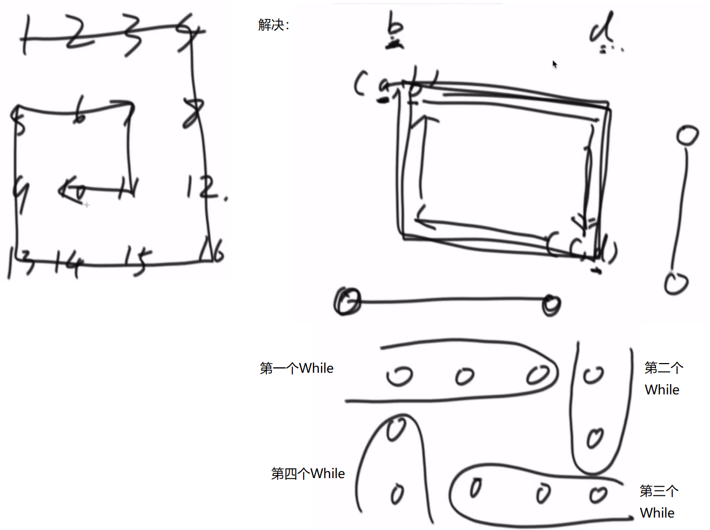
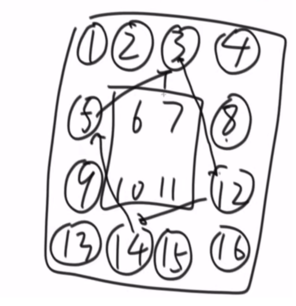
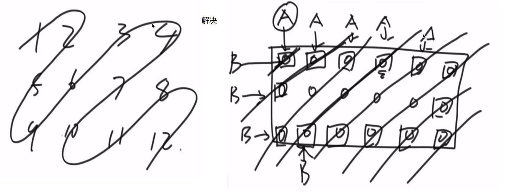
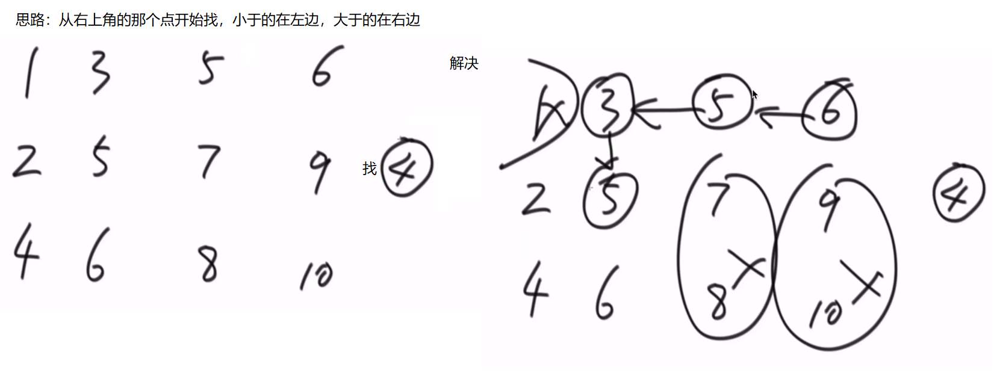
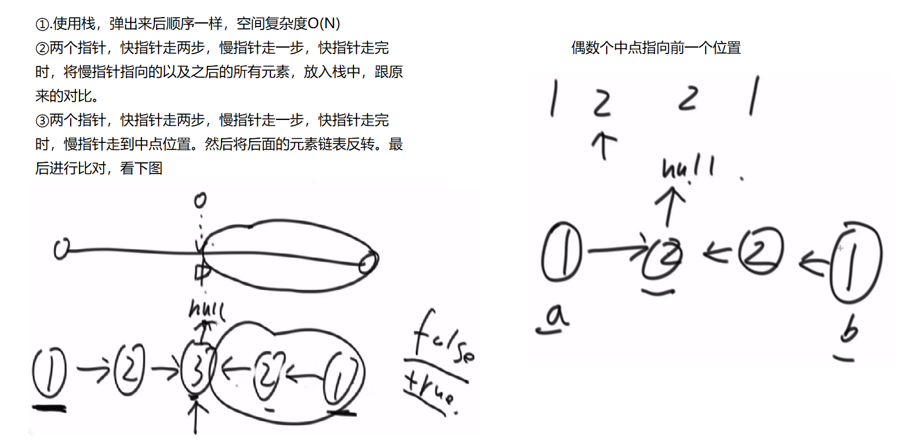
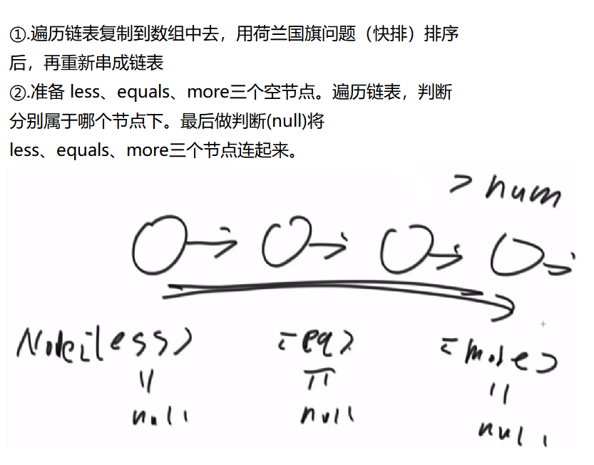
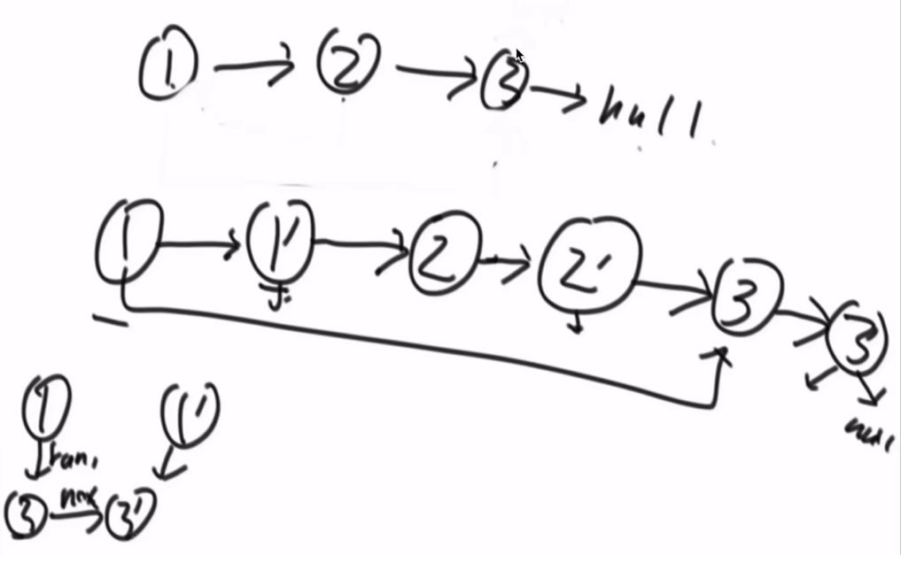
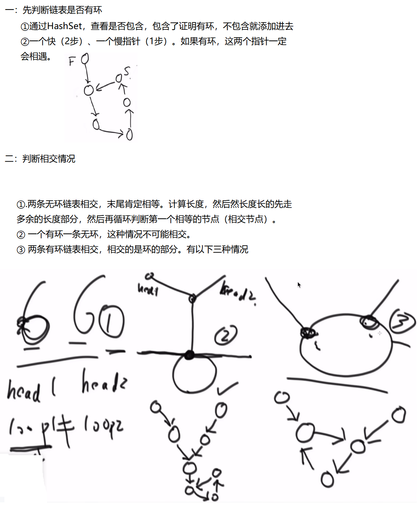

# <center>04.算法-各种题目(链表)练习<center>

# 1.猫狗队列

【题目】 宠物、狗和猫的类如下：

```
public class Pet { private String type;
public Pet(String type) { this.type = type; }
public String getPetType() { return this.type; }
}
public class Dog extends Pet { public Dog() { super("dog"); } }
public class Cat extends Pet { public Cat() { super("cat"); } }
```

实现一种狗猫队列的结构，要求如下： 用户可以调用add方法将cat类或dog类的实例放入队列中； 用户可以调用pollAll方法，
将队列中所有的实例按照进队列的先后顺序依次弹出； 用户可以调用pollDog方法，将队列中dog类的实例按照进队列的先后顺序依次弹出；
用户可以调用pollCat方法，将队列中cat类的实例按照进队列的先后顺序依次弹出； 用户可以调用isEmpty方法，检查队列中是否还有dog或cat的实例；
用户可以调用isDogEmpty方法，检查队列中是否有dog类的实例； 用户可以调用isCatEmpty方法，检查队列中是否有cat类的实例。


```java
public class Code_04_DogCatQueue {

	public static class Pet {
		private String type;

		public Pet(String type) {
			this.type = type;
		}

		public String getPetType() {
			return this.type;
		}
	}

	public static class Dog extends Pet {
		public Dog() {
			super("dog");
		}
	}

	public static class Cat extends Pet {
		public Cat() {
			super("cat");
		}
	}

	public static class PetEnterQueue {
		private Pet pet;
		private long count;

		public PetEnterQueue(Pet pet, long count) {
			this.pet = pet;
			this.count = count;
		}

		public Pet getPet() {
			return this.pet;
		}

		public long getCount() {
			return this.count;
		}

		public String getEnterPetType() {
			return this.pet.getPetType();
		}
	}

	public static class DogCatQueue {
		private Queue<PetEnterQueue> dogQ;
		private Queue<PetEnterQueue> catQ;
		private long count;

		public DogCatQueue() {
			this.dogQ = new LinkedList<PetEnterQueue>();
			this.catQ = new LinkedList<PetEnterQueue>();
			this.count = 0;
		}

		public void add(Pet pet) {
			if (pet.getPetType().equals("dog")) {
				this.dogQ.add(new PetEnterQueue(pet, this.count++));
			} else if (pet.getPetType().equals("cat")) {
				this.catQ.add(new PetEnterQueue(pet, this.count++));
			} else {
				throw new RuntimeException("err, not dog or cat");
			}
		}

		public Pet pollAll() {
			if (!this.dogQ.isEmpty() && !this.catQ.isEmpty()) {
				if (this.dogQ.peek().getCount() < this.catQ.peek().getCount()) {
					return this.dogQ.poll().getPet();
				} else {
					return this.catQ.poll().getPet();
				}
			} else if (!this.dogQ.isEmpty()) {
				return this.dogQ.poll().getPet();
			} else if (!this.catQ.isEmpty()) {
				return this.catQ.poll().getPet();
			} else {
				throw new RuntimeException("err, queue is empty!");
			}
		}

		public Dog pollDog() {
			if (!this.isDogQueueEmpty()) {
				return (Dog) this.dogQ.poll().getPet();
			} else {
				throw new RuntimeException("Dog queue is empty!");
			}
		}

		public Cat pollCat() {
			if (!this.isCatQueueEmpty()) {
				return (Cat) this.catQ.poll().getPet();
			} else
				throw new RuntimeException("Cat queue is empty!");
		}

		public boolean isEmpty() {
			return this.dogQ.isEmpty() && this.catQ.isEmpty();
		}

		public boolean isDogQueueEmpty() {
			return this.dogQ.isEmpty();
		}

		public boolean isCatQueueEmpty() {
			return this.catQ.isEmpty();
		}

	}
}
```

# 2.转圈打印矩阵

【题目】 给定一个整型矩阵matrix，请按照转圈的方式打印它。  
例如： 1 2 3 4 5 6 7 8 9 10 11 12 13 14 15 16 打印结果为：1，2，3，4，8，12，16，15，14，13，9，5，6，7，11， 10  
【要求】 额外空间复杂度为O(1)。



```java
public class Code_06_PrintMatrixSpiralOrder {

	public static void spiralOrderPrint(int[][] matrix) {
		int tR = 0;
		int tC = 0;
		int dR = matrix.length - 1;
		int dC = matrix[0].length - 1;
		while (tR <= dR && tC <= dC) {
			printEdge(matrix, tR++, tC++, dR--, dC--);
		}
	}

	/**
	 *
	 * @param m  二位数组
	 * @param tR 左上角的行
	 * @param tC 左上角的列
	 * @param dR 右下角的行
	 * @param dC 右下角的列
	 */
	public static void printEdge(int[][] m, int tR, int tC, int dR, int dC) {
		if (tR == dR) {
			for (int i = tC; i <= dC; i++) {
				System.out.print(m[tR][i] + " ");
			}
		} else if (tC == dC) {
			for (int i = tR; i <= dR; i++) {
				System.out.print(m[i][tC] + " ");
			}
		} else {
			int curC = tC;
			int curR = tR;
			while (curC != dC) {
				System.out.print(m[tR][curC] + " ");
				curC++;
			}
			while (curR != dR) {
				System.out.print(m[curR][dC] + " ");
				curR++;
			}
			while (curC != tC) {
				System.out.print(m[dR][curC] + " ");
				curC--;
			}
			while (curR != tR) {
				System.out.print(m[curR][tC] + " ");
				curR--;
			}
		}
	}
}
```


# 3.旋转正方形矩阵

【题目】 给定一个整型正方形矩阵matrix，请把该矩阵调整成顺时针旋转90度的样子。  
【要求】 额外空间复杂度为O(1)。



```java
public class Code_05_RotateMatrix {

	public static void rotate(int[][] matrix) {
		int tR = 0;
		int tC = 0;
		int dR = matrix.length - 1;
		int dC = matrix[0].length - 1;
		while (tR < dR) {  // 所有的外边框旋转
			rotateEdge(matrix, tR++, tC++, dR--, dC--);
		}
	}

	public static void rotateEdge(int[][] m, int tR, int tC, int dR, int dC) {
		int times = dC - tC; 
		int tmp = 0;
		for (int i = 0; i != times; i++) {
			tmp = m[tR][tC + i];
			m[tR][tC + i] = m[dR - i][tC];
			m[dR - i][tC] = m[dR][dC - i];
			m[dR][dC - i] = m[tR + i][dC];
			m[tR + i][dC] = tmp;
		}
	}

	public static void printMatrix(int[][] matrix) {
		for (int i = 0; i != matrix.length; i++) {
			for (int j = 0; j != matrix[0].length; j++) {
				System.out.print(matrix[i][j] + " ");
			}
			System.out.println();
		}
	}
}
```

# 4.反转单向和双向链表

【题目】 分别实现反转单向链表和反转双向链表的函数。  
【要求】 如果链表长度为N，时间复杂度要求为O(N)，额外空间复杂度要求为O(1)

```java
public class Code_07_ReverseList {

	public static class Node {
		public int value;
		public Node next;

		public Node(int data) {
			this.value = data;
		}
	}

	public static Node reverseList(Node head) {
		Node pre = null;
		Node next = null;
		while (head != null) {
			next = head.next;
			head.next = pre;
			pre = head;
			head = next;
		}
		return pre;
	}

	public static class DoubleNode {
		public int value;
		public DoubleNode last;
		public DoubleNode next;

		public DoubleNode(int data) {
			this.value = data;
		}
	}

	public static DoubleNode reverseList(DoubleNode head) {
		DoubleNode pre = null;
		DoubleNode next = null;
		while (head != null) {
			next = head.next;
			head.next = pre;
			head.last = next;
			pre = head;
			head = next;
		}
		return pre;
	}
}
```

# 5.“之”字形打印矩阵

【题目】 给定一个矩阵matrix，按照“之”字形的方式打印这个矩阵，
例如： 1 2 3 4 5 6 7 8 9 10 11 12“之”字形打印的结果为：1，2，5，9，6，3，4，7，10，11，8，12  
【要求】 额外空间复杂度为O(1)。



```java
public class Code_08_ZigZagPrintMatrix {

	public static void printMatrixZigZag(int[][] matrix) {
		int tR = 0;
		int tC = 0;
		int dR = 0;
		int dC = 0;
		int endR = matrix.length - 1;
		int endC = matrix[0].length - 1;
		boolean fromUp = false;
		while (tR != endR + 1) {
			printLevel(matrix, tR, tC, dR, dC, fromUp);
			tR = tC == endC ? tR + 1 : tR;
			tC = tC == endC ? tC : tC + 1;
			dC = dR == endR ? dC + 1 : dC;
			dR = dR == endR ? dR : dR + 1;
			fromUp = !fromUp;
		}
		System.out.println();
	}

	public static void printLevel(int[][] m, int tR, int tC, int dR, int dC,
			boolean f) {
		if (f) {
			while (tR != dR + 1) {
				System.out.print(m[tR++][tC--] + " ");
			}
		} else {
			while (dR != tR - 1) {
				System.out.print(m[dR--][dC++] + " ");
			}
		}
	}
}
```

# 6.在行列都排好序的矩阵中找数

【题目】 给定一个有N*M的整型矩阵matrix和一个整数K，matrix的每一行和每一 列都是排好序的。实现一个函数，判断K
是否在matrix中。 例如： 0 1 2 5 2 3 4 7 4 4 4 8 5 7 7 9 如果K为7，返回true；如果K为6，返回false。  
【要求】 时间复杂度为O(N+M)，额外空间复杂度为O(1)。



```java
public class Code_09_FindNumInSortedMatrix {

	public static boolean isContains(int[][] matrix, int K) {
		int row = 0;
		int col = matrix[0].length - 1;
		while (row < matrix.length && col > -1) {
			if (matrix[row][col] == K) {
				return true;
			} else if (matrix[row][col] > K) {
				col--;
			} else {
				row++;
			}
		}
		return false;
	}
}
```

# 7.打印两个有序链表的公共部分

【题目】 给定两个有序链表的头指针head1和head2，打印两个链表的公共部分。

```java
public class Code_10_PrintCommonPart {

	public static class Node {
		public int value;
		public Node next;
		public Node(int data) {
			this.value = data;
		}
	}

	public static void printCommonPart(Node head1, Node head2) {
		System.out.print("Common Part: ");
		while (head1 != null && head2 != null) {
			if (head1.value < head2.value) {
				head1 = head1.next;
			} else if (head1.value > head2.value) {
				head2 = head2.next;
			} else {
				System.out.print(head1.value + " ");
				head1 = head1.next;
				head2 = head2.next;
			}
		}
		System.out.println();
	}
}
```

# 8.判断一个链表是否为回文结构

【题目】 给定一个链表的头节点head，请判断该链表是否为回文结构。     
例如： 1->2->1，返回true。 1->2->2->1，返回true。15->6->15，返回true。 1->2->3，返回false。  
【进阶】： 如果链表长度为N，时间复杂度达到O(N)，额外空间复杂度达到O(1)。



```java
public class Code_11_IsPalindromeList {

	public static class Node {
		public int value;
		public Node next;

		public Node(int data) {
			this.value = data;
		}
	}

	// need n extra space
	public static boolean isPalindrome1(Node head) {
		Stack<Node> stack = new Stack<Node>();
		Node cur = head;
		while (cur != null) {
			stack.push(cur);
			cur = cur.next;
		}
		while (head != null) {
			if (head.value != stack.pop().value) {
				return false;
			}
			head = head.next;
		}
		return true;
	}

	// need n/2 extra space
	public static boolean isPalindrome2(Node head) {
		if (head == null || head.next == null) {
			return true;
		}
		Node right = head.next;
		Node cur = head;
		while (cur.next != null && cur.next.next != null) {
			right = right.next;
			cur = cur.next.next;
		}
		Stack<Node> stack = new Stack<Node>();
		while (right != null) {
			stack.push(right);
			right = right.next;
		}
		while (!stack.isEmpty()) {
			if (head.value != stack.pop().value) {
				return false;
			}
			head = head.next;
		}
		return true;
	}

	// need O(1) extra space
	public static boolean isPalindrome3(Node head) {
		if (head == null || head.next == null) {
			return true;
		}
		Node n1 = head;
		Node n2 = head;
		while (n2.next != null && n2.next.next != null) { // find mid node
			n1 = n1.next; // n1 -> mid
			n2 = n2.next.next; // n2 -> end
		}
		n2 = n1.next; // n2 -> right part first node
		n1.next = null; // mid.next -> null
		Node n3 = null;
		while (n2 != null) { // right part convert
			n3 = n2.next; // n3 -> save next node
			n2.next = n1; // next of right node convert
			n1 = n2; // n1 move
			n2 = n3; // n2 move
		}
		n3 = n1; // n3 -> save last node
		n2 = head;// n2 -> left first node
		boolean res = true;
		while (n1 != null && n2 != null) { // check palindrome
			if (n1.value != n2.value) {
				res = false;
				break;
			}
			n1 = n1.next; // left to mid
			n2 = n2.next; // right to mid
		}
		n1 = n3.next;
		n3.next = null;
		while (n1 != null) { // recover list
			n2 = n1.next;
			n1.next = n3;
			n3 = n1;
			n1 = n2;
		}
		return res;
	}
}
```

# 9.将单向链表按某值划分成左边小、中间相等、右边大的形式

【题目】 给定一个单向链表的头节点head，节点的值类型是整型，再给定一个
整 数pivot。实现一个调整链表的函数，将链表调整为左部分都是值小于 pivot
的节点，中间部分都是值等于pivot的节点，右部分都是值大于 pivot的节点。
除这个要求外，对调整后的节点顺序没有更多的要求。 例如：链表9->0->4->5->1，pivot=3。 调整后链表可以是1->0->4->9->5，也可以是0->1->9->5->4。总
之，满 足左部分都是小于3的节点，中间部分都是等于3的节点（本例中这个部
分为空），右部分都是大于3的节点即可。对某部分内部的节点顺序不做 要求。

进阶： 在原问题的要求之上再增加如下两个要求。
在左、中、右三个部分的内部也做顺序要求，要求每部分里的节点从左 到右的
顺序与原链表中节点的先后次序一致。 例如：链表9->0->4->5->1，pivot=3。
调整后的链表是0->1->9->4->5。 在满足原问题要求的同时，左部分节点从左到
右为0、1。在原链表中也 是先出现0，后出现1；中间部分在本例中为空，不再
讨论；右部分节点 从左到右为9、4、5。在原链表中也是先出现9，然后出现4，
最后出现5。
如果链表长度为N，时间复杂度请达到O(N)，额外空间复杂度请达到O(1)



```java
	public class Code_12_SmallerEqualBigger {
    
    	public static class Node {
    		public int value;
    		public Node next;
    
    		public Node(int data) {
    			this.value = data;
    		}
    	}
    
    	public static Node listPartition1(Node head, int pivot) {
    		if (head == null) {
    			return head;
    		}
    		Node cur = head;
    		int i = 0;
    		while (cur != null) {
    			i++;
    			cur = cur.next;
    		}
    		Node[] nodeArr = new Node[i];
    		i = 0;
    		cur = head;
    		for (i = 0; i != nodeArr.length; i++) {
    			nodeArr[i] = cur;
    			cur = cur.next;
    		}
    		arrPartition(nodeArr, pivot);
    		for (i = 1; i != nodeArr.length; i++) {
    			nodeArr[i - 1].next = nodeArr[i];
    		}
    		nodeArr[i - 1].next = null;
    		return nodeArr[0];
    	}
    
    	public static void arrPartition(Node[] nodeArr, int pivot) {
    		int small = -1;
    		int big = nodeArr.length;
    		int index = 0;
    		while (index != big) {
    			if (nodeArr[index].value < pivot) {
    				swap(nodeArr, ++small, index++);
    			} else if (nodeArr[index].value == pivot) {
    				index++;
    			} else {
    				swap(nodeArr, --big, index);
    			}
    		}
    	}
    
    	public static void swap(Node[] nodeArr, int a, int b) {
    		Node tmp = nodeArr[a];
    		nodeArr[a] = nodeArr[b];
    		nodeArr[b] = tmp;
    	}
    
    	public static Node listPartition2(Node head, int pivot) {
    		Node sH = null; // small head
    		Node sT = null; // small tail
    		Node eH = null; // equal head
    		Node eT = null; // equal tail
    		Node bH = null; // big head
    		Node bT = null; // big tail
    		Node next = null; // save next node
    		// every node distributed to three lists
    		while (head != null) {
    			next = head.next;
    			head.next = null;
    			if (head.value < pivot) {
    				if (sH == null) {
    					sH = head;
    					sT = head;
    				} else {
    					sT.next = head;
    					sT = head;
    				}
    			} else if (head.value == pivot) {
    				if (eH == null) {
    					eH = head;
    					eT = head;
    				} else {
    					eT.next = head;
    					eT = head;
    				}
    			} else {
    				if (bH == null) {
    					bH = head;
    					bT = head;
    				} else {
    					bT.next = head;
    					bT = head;
    				}
    			}
    			head = next;
    		}
    		// small and equal reconnect
    		if (sT != null) {
    			sT.next = eH;
    			eT = eT == null ? sT : eT;
    		}
    		// all reconnect
    		if (eT != null) {
    			eT.next = bH;
    		}
    		return sH != null ? sH : eH != null ? eH : bH;
    	}
}
```

# 10.复制含有随机指针节点的链表

复制含有随机指针节点的链表
【题目】 一种特殊的链表节点类描述如下：

```java
public class Node { public int value; public Node next; public
Node rand;
public Node(int data) { this.value = data; }
}
```

Node类中的value是节点值，next指针和正常单链表中next指针的意义
一 样，都指向下一个节点，rand指针是Node类中新增的指针，这个指
针可 能指向链表中的任意一个节点，也可能指向null。 给定一个由
Node节点类型组成的无环单链表的头节点head，请实现一个 函数完成
这个链表中所有结构的复制，并返回复制的新链表的头节点。 进阶：
不使用额外的数据结构，只用有限几个变量，且在时间复杂度为 O(N)
内完成原问题要实现的函数。



```java
public class Code_13_CopyListWithRandom {

	public static class Node {
		public int value;
		public Node next;
		public Node rand;

		public Node(int data) {
			this.value = data;
		}
	}

	public static Node copyListWithRand1(Node head) {
		HashMap<Node, Node> map = new HashMap<Node, Node>();
		Node cur = head;
		while (cur != null) {
			map.put(cur, new Node(cur.value));
			cur = cur.next;
		}
		cur = head;
		while (cur != null) {
			map.get(cur).next = map.get(cur.next);
			map.get(cur).rand = map.get(cur.rand);
			cur = cur.next;
		}
		return map.get(head);
	}

	public static Node copyListWithRand2(Node head) {
		if (head == null) {
			return null;
		}
		Node cur = head;
		Node next = null;
		// copy node and link to every node
		while (cur != null) {
			next = cur.next;
			cur.next = new Node(cur.value);
			cur.next.next = next;
			cur = next;
		}
		cur = head;
		Node curCopy = null;
		// set copy node rand
		while (cur != null) {
			next = cur.next.next;
			curCopy = cur.next;
			curCopy.rand = cur.rand != null ? cur.rand.next : null;
			cur = next;
		}
		Node res = head.next;
		cur = head;
		// split
		while (cur != null) {
			next = cur.next.next;
			curCopy = cur.next;
			cur.next = next;
			curCopy.next = next != null ? next.next : null;
			cur = next;
		}
		return res;
	}
}
```

# 11.两个单链表相交的一系列问题

【题目】 在本题中，单链表可能有环，也可能无环。给定两个
单链表的头节点 head1和head2，这两个链表可能相交，也可能
不相交。请实现一个函数， 如果两个链表相交，请返回相交的
第一个节点；如果不相交，返回null 即可。 要求：如果链表1
的长度为N，链表2的长度为M，时间复杂度请达到 O(N+M)，额外
空间复杂度请达到O(1)。



```java
public class Code_14_FindFirstIntersectNode {

	public static class Node {
		public int value;
		public Node next;

		public Node(int data) {
			this.value = data;
		}
	}

	public static Node getIntersectNode(Node head1, Node head2) {
		if (head1 == null || head2 == null) {
			return null;
		}
		Node loop1 = getLoopNode(head1);
		Node loop2 = getLoopNode(head2);
		if (loop1 == null && loop2 == null) {
			return noLoop(head1, head2);
		}
		if (loop1 != null && loop2 != null) {
			return bothLoop(head1, loop1, head2, loop2);
		}
		return null;
	}

	public static Node getLoopNode(Node head) {
		if (head == null || head.next == null || head.next.next == null) {
			return null;
		}
		Node n1 = head.next; // n1 -> slow
		Node n2 = head.next.next; // n2 -> fast
		while (n1 != n2) {
			if (n2.next == null || n2.next.next == null) {
				return null;
			}
			n2 = n2.next.next;
			n1 = n1.next;
		}
		n2 = head; // n2 -> walk again from head
		while (n1 != n2) {
			n1 = n1.next;
			n2 = n2.next;
		}
		return n1;
	}

	public static Node noLoop(Node head1, Node head2) {
		if (head1 == null || head2 == null) {
			return null;
		}
		Node cur1 = head1;
		Node cur2 = head2;
		int n = 0;
		while (cur1.next != null) {
			n++;
			cur1 = cur1.next;
		}
		while (cur2.next != null) {
			n--;
			cur2 = cur2.next;
		}
		if (cur1 != cur2) {
			return null;
		}
		cur1 = n > 0 ? head1 : head2;
		cur2 = cur1 == head1 ? head2 : head1;
		n = Math.abs(n);
		while (n != 0) {
			n--;
			cur1 = cur1.next;
		}
		while (cur1 != cur2) {
			cur1 = cur1.next;
			cur2 = cur2.next;
		}
		return cur1;
	}

	public static Node bothLoop(Node head1, Node loop1, Node head2, Node loop2) {
		Node cur1 = null;
		Node cur2 = null;
		if (loop1 == loop2) {
			cur1 = head1;
			cur2 = head2;
			int n = 0;
			while (cur1 != loop1) {
				n++;
				cur1 = cur1.next;
			}
			while (cur2 != loop2) {
				n--;
				cur2 = cur2.next;
			}
			cur1 = n > 0 ? head1 : head2;
			cur2 = cur1 == head1 ? head2 : head1;
			n = Math.abs(n);
			while (n != 0) {
				n--;
				cur1 = cur1.next;
			}
			while (cur1 != cur2) {
				cur1 = cur1.next;
				cur2 = cur2.next;
			}
			return cur1;
		} else {
			cur1 = loop1.next;
			while (cur1 != loop1) {
				if (cur1 == loop2) {
					return loop1;
				}
				cur1 = cur1.next;
			}
			return null;
		}
	}
}
```