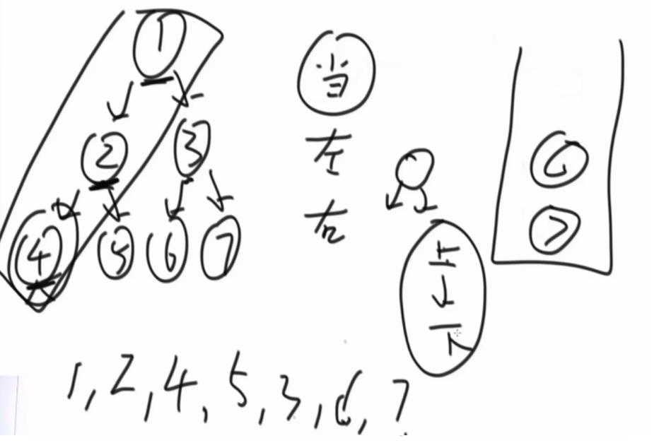
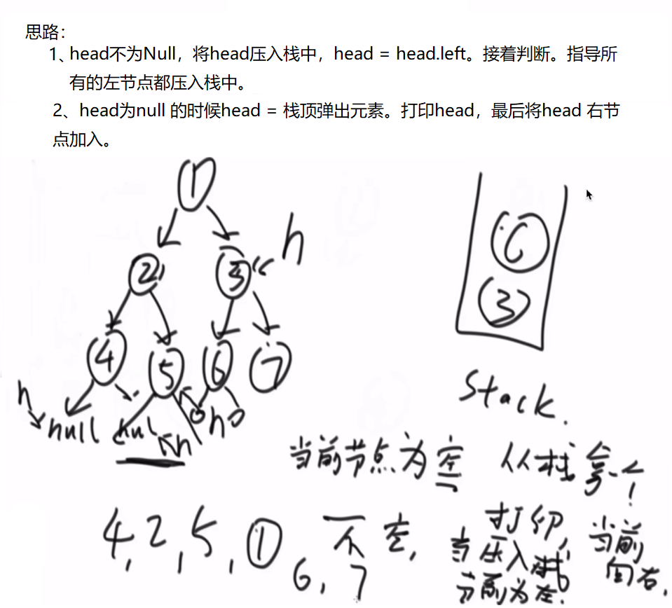
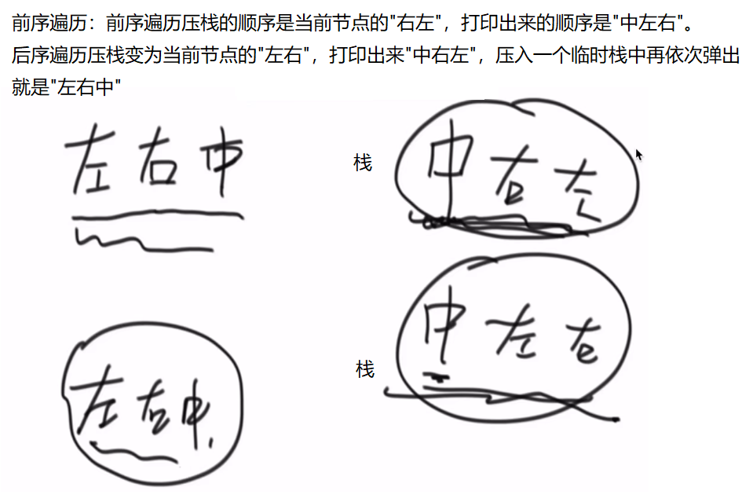
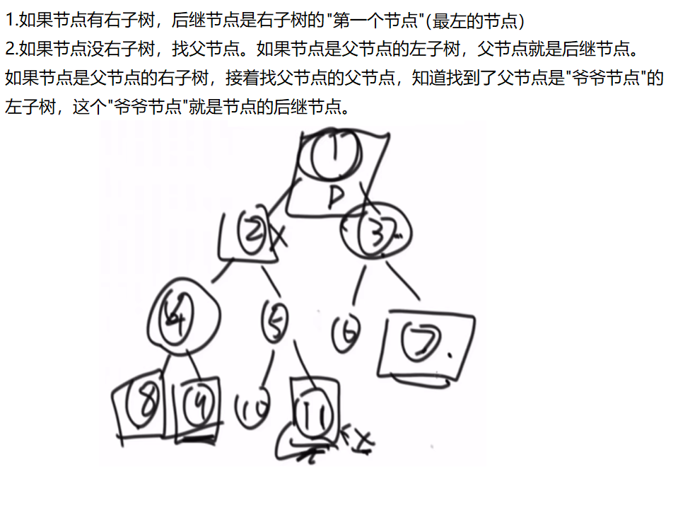
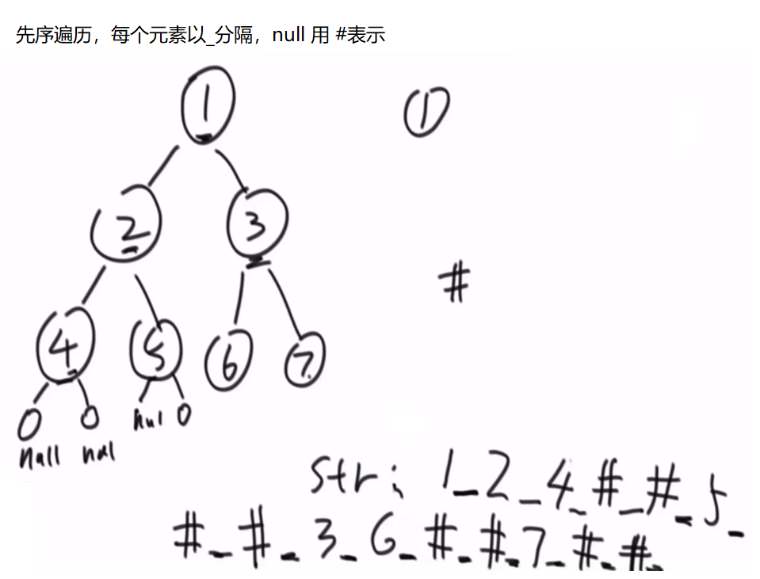
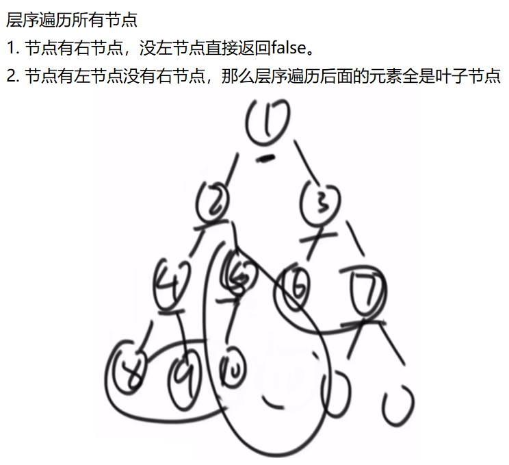
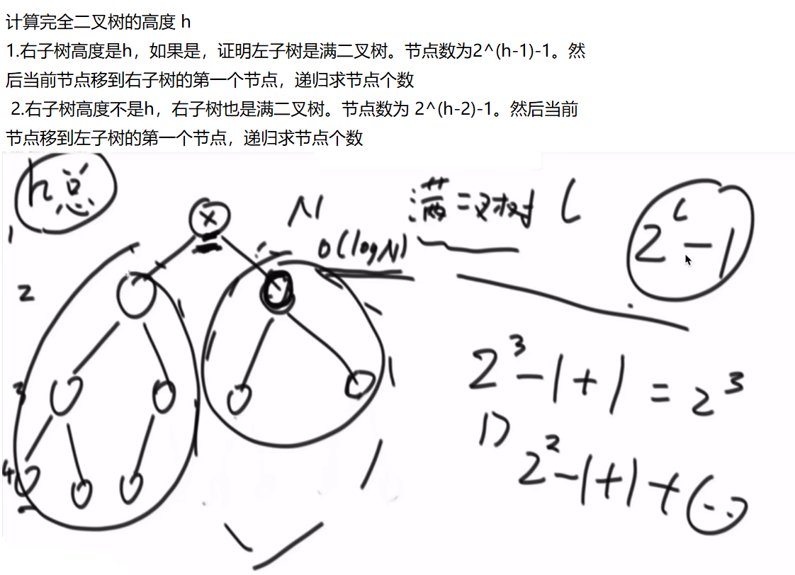

# <center>04.算法-各种题目(树)练习<center>

# 1.实现二叉树的先序、中序、后序遍历，包括递归方式和非递归方式
非递归方式实现二叉树前序遍历：


非递归方式实现二叉树中序遍历：


非递归方式实现二叉树后序遍历：


```java
public class Code_01_PreInPosTraversal {

	public static class Node {
		public int value;
		public Node left;
		public Node right;

		public Node(int data) {
			this.value = data;
		}
	}
    // 递归方式前序
	public static void preOrderRecur(Node head) {
		if (head == null) {
			return;
		}
		System.out.print(head.value + " ");
		preOrderRecur(head.left);
		preOrderRecur(head.right);
	}
	
    // 递归方式中序
	public static void inOrderRecur(Node head) {
		if (head == null) {
			return;
		}
		inOrderRecur(head.left);
		System.out.print(head.value + " ");
		inOrderRecur(head.right);
	}
    
    // 递归方式后序
	public static void posOrderRecur(Node head) {
		if (head == null) {
			return;
		}
		posOrderRecur(head.left);
		posOrderRecur(head.right);
		System.out.print(head.value + " ");
	}
    // 非递归方式前序
	public static void preOrderUnRecur(Node head) {
		System.out.print("pre-order: ");
		if (head != null) {
			Stack<Node> stack = new Stack<Node>();
			stack.add(head);
			while (!stack.isEmpty()) {
				head = stack.pop();
				System.out.print(head.value + " ");
				if (head.right != null) {
					stack.push(head.right);
				}
				if (head.left != null) {
					stack.push(head.left);
				}
			}
		}
		System.out.println();
	}
    // 非递归方式中序
	public static void inOrderUnRecur(Node head) {
		System.out.print("in-order: ");
		if (head != null) {
			Stack<Node> stack = new Stack<Node>();
			while (!stack.isEmpty() || head != null) {
				if (head != null) {
					stack.push(head);
					head = head.left;
				} else {
					head = stack.pop();
					System.out.print(head.value + " ");
					head = head.right;
				}
			}
		}
		System.out.println();
	}
    // 非递归方式后序
	public static void posOrderUnRecur1(Node head) {
		System.out.print("pos-order: ");
		if (head != null) {
			Stack<Node> s1 = new Stack<Node>();
			Stack<Node> s2 = new Stack<Node>();
			s1.push(head);
			while (!s1.isEmpty()) {
				head = s1.pop();
				s2.push(head);
				if (head.left != null) {
					s1.push(head.left);
				}
				if (head.right != null) {
					s1.push(head.right);
				}
			}
			while (!s2.isEmpty()) {
				System.out.print(s2.pop().value + " ");
			}
		}
		System.out.println();
	}
}
```

# 2.层序遍历

```java
public class myTest(){
	public static class Node {
		public int value;
		public Node left;
		public Node right;

		public Node(int data) {
			this.value = data;
		}
	}

	public static void levelOrderTraverse(Node head) {
		if (head == null) {
			return;
		}
		Queue<Node> queue = new LinkedList<Node>();
		queue.offer(head);
		while (!queue.isEmpty()) {
			head = queue.poll();
            System.out.println(head.value);
			if (head.left != null) {
				queue.offer(head.left);
			}

			if (head.right != null) {
				queue.offer(head.right);
			}
		}
		return res;
	}
}
```

# 3.在二叉树中找到一个节点的后继节点

【题目】 现在有一种新的二叉树节点类型如下：

```java
public class Node { public int value; public Node left;
public Node right; public Node parent;
public Node(int data) { this.value = data; }
}
```

该结构比普通二叉树节点结构多了一个指向父节点的parent指针。假设有一 棵Node类型的节点组成的二叉树，树中每个节点的parent指针
都正确地指向 自己的父节点，头节点的parent指向null。只给一个在二叉树中的某个节点 node，请实现返回node的后继节点的函数。在二
叉树的中序遍历的序列中， node的下一个节点叫作node的后继节点。




```java
public class Code_03_SuccessorNode {

	public static class Node {
		public int value;
		public Node left;
		public Node right;
		public Node parent;

		public Node(int data) {
			this.value = data;
		}
	}

	public static Node getSuccessorNode(Node node) {
		if (node == null) {
			return node;
		}
		if (node.right != null) {
			return getLeftMost(node.right);
		} else {
			Node parent = node.parent;
			while (parent != null && parent.left != node) {
				node = parent;
				parent = node.parent;
			}
			return parent;
		}
	}

	public static Node getLeftMost(Node node) {
		if (node == null) {
			return node;
		}
		while (node.left != null) {
			node = node.left;
		}
		return node;
	}
}
```

# 4.二叉树的序列化和反序列化



```java
public class Code_04_SerializeAndReconstructTree {

	public static class Node {
		public int value;
		public Node left;
		public Node right;

		public Node(int data) {
			this.value = data;
		}
	}

	public static String serialByPre(Node head) {
		if (head == null) {
			return "#!";
		}
		String res = head.value + "!";
		res += serialByPre(head.left);
		res += serialByPre(head.right);
		return res;
	}

	public static Node reconByPreString(String preStr) {
		String[] values = preStr.split("!");
		Queue<String> queue = new LinkedList<String>();
		for (int i = 0; i != values.length; i++) {
			queue.offer(values[i]);
		}
		return reconPreOrder(queue);
	}

	public static Node reconPreOrder(Queue<String> queue) {
		String value = queue.poll();
		if (value.equals("#")) {
			return null;
		}
		Node head = new Node(Integer.valueOf(value));
		head.left = reconPreOrder(queue);
		head.right = reconPreOrder(queue);
		return head;
	}

	public static String serialByLevel(Node head) {
		if (head == null) {
			return "#!";
		}
		String res = head.value + "!";
		Queue<Node> queue = new LinkedList<Node>();
		queue.offer(head);
		while (!queue.isEmpty()) {
			head = queue.poll();
			if (head.left != null) {
				res += head.left.value + "!";
				queue.offer(head.left);
			} else {
				res += "#!";
			}
			if (head.right != null) {
				res += head.right.value + "!";
				queue.offer(head.right);
			} else {
				res += "#!";
			}
		}
		return res;
	}

	public static Node reconByLevelString(String levelStr) {
		String[] values = levelStr.split("!");
		int index = 0;
		Node head = generateNodeByString(values[index++]);
		Queue<Node> queue = new LinkedList<Node>();
		if (head != null) {
			queue.offer(head);
		}
		Node node = null;
		while (!queue.isEmpty()) {
			node = queue.poll();
			node.left = generateNodeByString(values[index++]);
			node.right = generateNodeByString(values[index++]);
			if (node.left != null) {
				queue.offer(node.left);
			}
			if (node.right != null) {
				queue.offer(node.right);
			}
		}
		return head;
	}

	public static Node generateNodeByString(String val) {
		if (val.equals("#")) {
			return null;
		}
		return new Node(Integer.valueOf(val));
	}
}
```

# 5.判断一棵二叉树是否是平衡二叉树

```java
public class Code_06_IsBalancedTree {

	public static class Node {
		public int value;
		public Node left;
		public Node right;

		public Node(int data) {
			this.value = data;
		}
	}
    int getDepthTree(Node pNode){
        if(pNode==null)
            return 0;
        int left = getDepthTree(pNode.left);
        int right = getDepthTree(pNode.right);
        return max(left,right) + 1; // 需要加上自己
    }

	public static boolean isBalance(Node head) {
        // 可以是一棵空树，左右子树的高度差不会超过 1 ，并且左右两棵子树都是一棵平衡二叉树
        if(head == null)
            return true;
    
        // 左右子树的高度差不会超过 1
        int left = getDepthTree(head.left);
        int right = getDepthTree(head.right);
    
        // 并且左右两棵子树都是一棵平衡二叉树
        return Math.abs(left-right) <= 1 && isBalanceTree(head.left) && isBalanceTree(head.right);
	}
}
```

# 6.判断一棵树是否是搜索二叉树、判断一棵树是否是完全二叉树

二叉搜索树：中序遍历是有序的就是二叉搜索树。



```java
public class Code_07_IsBSTAndCBT {

	public static class Node {
		public int value;
		public Node left;
		public Node right;

		public Node(int data) {
			this.value = data;
		}
	}

	public static boolean isBST(Node head) {
		if (head == null) {
			return true;
		}
		boolean res = true;
		Node pre = null;
		Node cur1 = head;
		Node cur2 = null;
		while (cur1 != null) {
			cur2 = cur1.left;
			if (cur2 != null) {
				while (cur2.right != null && cur2.right != cur1) {
					cur2 = cur2.right;
				}
				if (cur2.right == null) {
					cur2.right = cur1;
					cur1 = cur1.left;
					continue;
				} else {
					cur2.right = null;
				}
			}
			if (pre != null && pre.value > cur1.value) {
				res = false;
			}
			pre = cur1;
			cur1 = cur1.right;
		}
		return res;
	}

	public static boolean isCBT(Node head) {
		if (head == null) {
			return true;
		}
		Queue<Node> queue = new LinkedList<Node>();
		boolean leaf = false; // 是否满足条件2，到了叶子节点的状态。
		Node l = null;
		Node r = null;
		queue.offer(head);
		while (!queue.isEmpty()) {
			head = queue.poll();
			l = head.left;
			r = head.right;
			if ((leaf && (l != null || r != null)) || (l == null && r != null)) {
				return false;
			}
			if (l != null) {
				queue.offer(l);
			}
			if (r != null) {
				queue.offer(r);
			} else {
				leaf = true;
			}
		}
		return true;
	}
}
```

# 7.已知一棵完全二叉树，求其节点的个数

要求：时间复杂度低于O(N)，N为这棵树的节点个数



```java
public class Code_08_CompleteTreeNodeNumber {

	public static class Node {
		public int value;
		public Node left;
		public Node right;

		public Node(int data) {
			this.value = data;
		}
	}

	public static int nodeNum(Node head) {
		if (head == null) {
			return 0;
		}
		return bs(head, 1, mostLeftLevel(head, 1));
	}

	public static int bs(Node node, int l, int h) {
		if (l == h) {
			return 1;
		}
		if (mostLeftLevel(node.right, l + 1) == h) {
			return (1 << (h - l)) + bs(node.right, l + 1, h);
		} else {
			return (1 << (h - l - 1)) + bs(node.left, l + 1, h);
		}
	}

	public static int mostLeftLevel(Node node, int level) {
		while (node != null) {
			level++;
			node = node.left;
		}
		return level - 1;
	}
}
```
