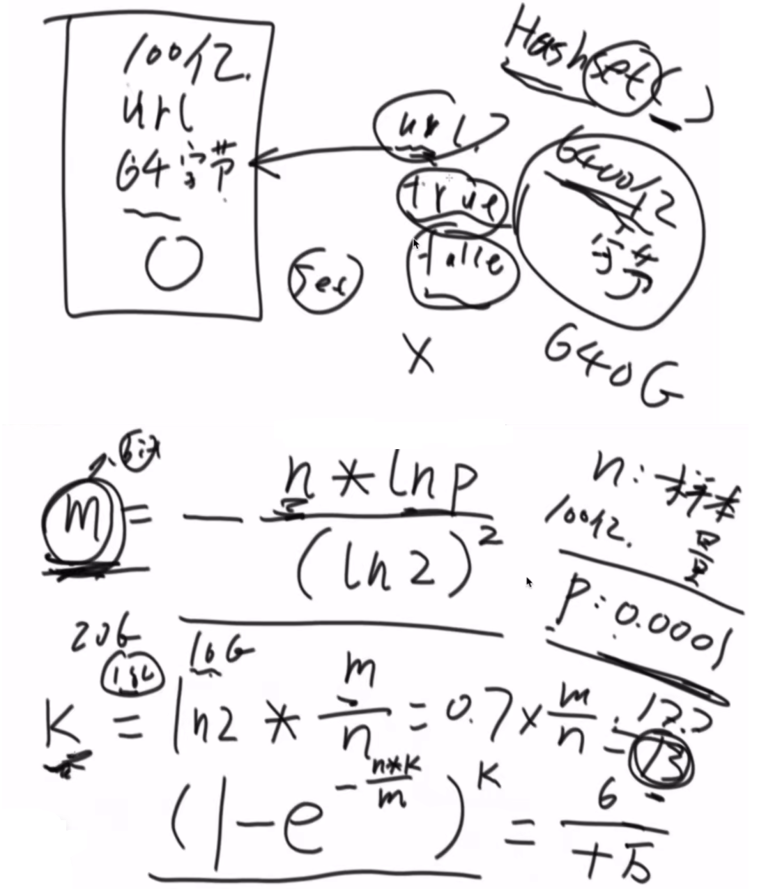
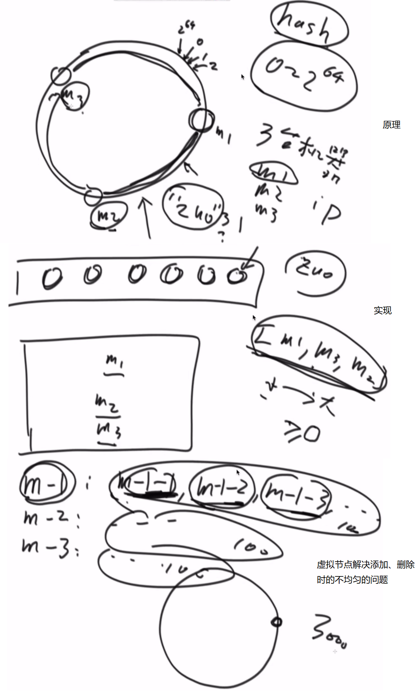

# <center>06.哈希<center>

# 1.哈希函数（散列性函数）

特性：  
1. 输入域无穷大（输入的参数，比如String）
2. 输出域有穷大
3. 如果输入相同，输出也会相同
4. 如果输入不同，输出也可能相同（Hash碰撞）
5. 离散型，输入参数的量起来的时候，每个输出点的个数均匀分布


# 2.设计RandomPool结构

```java
public class Code_02_RandomPool {

	public static class Pool<K> {
		private HashMap<K, Integer> keyIndexMap;
		private HashMap<Integer, K> indexKeyMap;
		private int size;

		public Pool() {
			this.keyIndexMap = new HashMap<K, Integer>();
			this.indexKeyMap = new HashMap<Integer, K>();
			this.size = 0;
		}

		public void insert(K key) {
			if (!this.keyIndexMap.containsKey(key)) {
				this.keyIndexMap.put(key, this.size);
				this.indexKeyMap.put(this.size++, key);
			}
		}

		public void delete(K key) {
			if (this.keyIndexMap.containsKey(key)) {
				int deleteIndex = this.keyIndexMap.get(key);
				int lastIndex = --this.size;
				K lastKey = this.indexKeyMap.get(lastIndex);
				this.keyIndexMap.put(lastKey, deleteIndex);
				this.indexKeyMap.put(deleteIndex, lastKey);
				this.keyIndexMap.remove(key);
				this.indexKeyMap.remove(lastIndex);
			}
		}

		public K getRandom() {
			if (this.size == 0) {
				return null;
			}
			int randomIndex = (int) (Math.random() * this.size); // 0 ~ size -1
			return this.indexKeyMap.get(randomIndex);
		}

	}
}
```

# 3.认识布隆过滤器

某种类型的集合，有失误率。



# 4.一致性哈希


