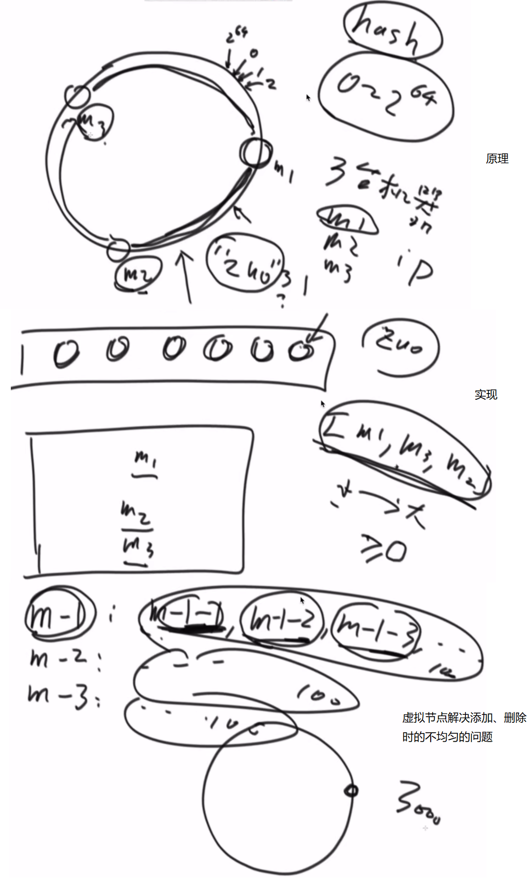

# <center>06.哈希、布隆过滤器、一致性哈希、并查结构<center>

# 1.哈希函数（散列性函数）

特性：  
1. 输入域无穷大（输入的参数，比如String）
2. 输出域有穷大
3. 如果输入相同，输出也会相同
4. 如果输入不同，输出也可能相同（Hash碰撞）
5. 离散型，输入参数的量起来的时候，每个输出点的个数均匀分布


# 2.设计RandomPool结构

```java
public class Code_02_RandomPool {

	public static class Pool<K> {
		private HashMap<K, Integer> keyIndexMap;
		private HashMap<Integer, K> indexKeyMap;
		private int size;

		public Pool() {
			this.keyIndexMap = new HashMap<K, Integer>();
			this.indexKeyMap = new HashMap<Integer, K>();
			this.size = 0;
		}

		public void insert(K key) {
			if (!this.keyIndexMap.containsKey(key)) {
				this.keyIndexMap.put(key, this.size);
				this.indexKeyMap.put(this.size++, key);
			}
		}

		public void delete(K key) {
			if (this.keyIndexMap.containsKey(key)) {
				int deleteIndex = this.keyIndexMap.get(key);
				int lastIndex = --this.size;
				K lastKey = this.indexKeyMap.get(lastIndex);
				this.keyIndexMap.put(lastKey, deleteIndex);
				this.indexKeyMap.put(deleteIndex, lastKey);
				this.keyIndexMap.remove(key);
				this.indexKeyMap.remove(lastIndex);
			}
		}

		public K getRandom() {
			if (this.size == 0) {
				return null;
			}
			int randomIndex = (int) (Math.random() * this.size); // 0 ~ size -1
			return this.indexKeyMap.get(randomIndex);
		}

	}
}
```

# 3.认识布隆过滤器

某种类型的集合，有失误率。


# 4.一致性哈希




# 5.并查结构


```java
public class Code_04_UnionFind {

	public static class Node {
		// whatever you like
	}

	public static class UnionFindSet {
		public HashMap<Node, Node> fatherMap; // key ：child， value : father
		public HashMap<Node, Integer> sizeMap; // 某一个节点所在的集合有多少个节点

		public UnionFindSet() {
			fatherMap = new HashMap<Node, Node>();
			sizeMap = new HashMap<Node, Integer>();
		}

		public void makeSets(List<Node> nodes) {
			fatherMap.clear();
			sizeMap.clear();
			for (Node node : nodes) {
				fatherMap.put(node, node); // 每个节点都是一个集合
				sizeMap.put(node, 1);
			}
		}

		private Node findHead(Node node) {
			Node father = fatherMap.get(node);
			if (father != node) {
				father = findHead(father);
			}
			fatherMap.put(node, father);
			return father;
		}
		
		public boolean isSameSet(Node a, Node b) {
			return findHead(a) == findHead(b);
		}

		public void union(Node a, Node b) {
			if (a == null || b == null) {
				return;
			}
			Node aHead = findHead(a);
			Node bHead = findHead(b);
			if (aHead != bHead) {
				int aSetSize= sizeMap.get(aHead);
				int bSetSize = sizeMap.get(bHead);
				if (aSetSize <= bSetSize) {
					fatherMap.put(aHead, bHead);
					sizeMap.put(bHead, aSetSize + bSetSize);
				} else {
					fatherMap.put(bHead, aHead);
					sizeMap.put(aHead, aSetSize + bSetSize);
				}
			}
		}

	}
}
```

# 6.岛问题

```java
public class Code_03_Islands {

	public static int countIslands(int[][] m) {
		if (m == null || m[0] == null) {
			return 0;
		}
		int N = m.length;
		int M = m[0].length;
		int res = 0;
		for (int i = 0; i < N; i++) {
			for (int j = 0; j < M; j++) {
				if (m[i][j] == 1) {
					res++;
					infect(m, i, j, N, M);
				}
			}
		}
		return res;
	}

	public static void infect(int[][] m, int i, int j, int N, int M) {
		if (i < 0 || i >= N || j < 0 || j >= M || m[i][j] != 1) {
			return;
		}
		m[i][j] = 2;
		infect(m, i + 1, j, N, M);
		infect(m, i - 1, j, N, M);
		infect(m, i, j + 1, N, M);
		infect(m, i, j - 1, N, M);
	}
}
```
