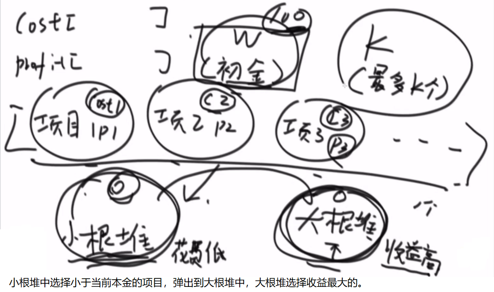

# <center>07.前缀树和题目<center>

# 1.前缀树

什么是前缀树，看下图就了解了


```java
public class Code_01_TrieTree {

	public static class TrieNode {
		public int path; // 有多少个字符串经过这个节点
		public int end;  // 有多少个字符串以这个节点结尾的
		public TrieNode[] nexts;

		public TrieNode() {
			path = 0;
			end = 0;
			nexts = new TrieNode[26]; // 26个字母，26条路
		}
	}

	public static class Trie {
		private TrieNode root;

		public Trie() {
			root = new TrieNode();
		}

		public void insert(String word) {
			if (word == null) {
				return;
			}
			char[] chs = word.toCharArray();
			TrieNode node = root;
			int index = 0;
			for (int i = 0; i < chs.length; i++) {
				index = chs[i] - 'a';
				if (node.nexts[index] == null) {
					node.nexts[index] = new TrieNode();
				}
				node = node.nexts[index];
				node.path++;
			}
			node.end++;
		}

		public void delete(String word) {
			if (search(word) != 0) {
				char[] chs = word.toCharArray();
				TrieNode node = root;
				int index = 0;
				for (int i = 0; i < chs.length; i++) {
					index = chs[i] - 'a';
					if (--node.nexts[index].path == 0) {
						node.nexts[index] = null;
						return;
					}
					node = node.nexts[index];
				}
				node.end--;
			}
		}

		public int search(String word) {
			if (word == null) {
				return 0;
			}
			char[] chs = word.toCharArray();
			TrieNode node = root;
			int index = 0;
			for (int i = 0; i < chs.length; i++) {
				index = chs[i] - 'a';
				if (node.nexts[index] == null) {
					return 0;
				}
				node = node.nexts[index];
			}
			return node.end;
		}

		public int prefixNumber(String pre) {
			if (pre == null) {
				return 0;
			}
			char[] chs = pre.toCharArray();
			TrieNode node = root;
			int index = 0;
			for (int i = 0; i < chs.length; i++) {
				index = chs[i] - 'a';
				if (node.nexts[index] == null) {
					return 0;
				}
				node = node.nexts[index];
			}
			return node.path;
		}
	}
}
```

# 2.金条题目(贪心策略)

一块金条切成两半，是需要花费和长度数值一样的铜板的。比如长度为20的 金条，不管切成长度多大的两半，都要花费20个铜板。一群人想整分整块金 条，怎么分最省铜板？
例如,给定数组{10,20,30}，代表一共三个人，整块金条长度为10+20+30=60. 金条要分成10,20,30三个部分。 如果， 先把长度60的金条分成10和50，花费60 再把长度50的金条分成20和30，
花费50 一共花费110铜板。但是如果， 先把长度60的金条分成30和30，花费60 再把长度30金条分成10和20，花费30 一共花费90铜板。输入一个数组，返回分割的最小代价。

解题采用：`哈夫曼编码思想`，用堆来解决

```java
public class Code_02_Less_Money {

	public static int lessMoney(int[] arr) {
		PriorityQueue<Integer> pQ = new PriorityQueue<>();
		for (int i = 0; i < arr.length; i++) {
			pQ.add(arr[i]);
		}
		int sum = 0;
		int cur = 0;
		while (pQ.size() > 1) {
			cur = pQ.poll() + pQ.poll();
			sum += cur;
			pQ.add(cur);
		}
		return sum;
	}

	public static class MinheapComparator implements Comparator<Integer> {

		@Override
		public int compare(Integer o1, Integer o2) {
			return o1 - o2; // < 0  o1 < o2  负数
		}

	}

	public static class MaxheapComparator implements Comparator<Integer> {

		@Override
		public int compare(Integer o1, Integer o2) {
			return o2 - o1; // <   o2 < o1
		}

	}
}
```


# 3.贪心策略题目

输入： 参数1，正数数组costs 参数2，正数数组profits 参数3，正数k 参数4，正数m。  
costs[i]表示i号项目的花费 profits[i]表示i号项目在扣除花费之后还能挣到的钱(利润) k表示你不能并行、只能串行的最多做k个项目 m表示你初始的资金说明：你每做完一个项目，马上获得的收益，可以支持你去做下一个 项目。  
输出： 你最后获得的最大钱数。



```java
public class Code_03_IPO {
	public static class Node {
		public int p; // 收益 
		public int c; // 话费

		public Node(int p, int c) {
			this.p = p;
			this.c = c;
		}
	}

	public static class MinCostComparator implements Comparator<Node> {

		@Override
		public int compare(Node o1, Node o2) {
			return o1.c - o2.c;
		}

	}

	public static class MaxProfitComparator implements Comparator<Node> {

		@Override
		public int compare(Node o1, Node o2) {
			return o2.p - o1.p;
		}

	}

	/**
	 *
	 * @param k 做多少个k项目
	 * @param W 本金
	 * @param Profits 收益
	 * @param Capital 花费
	 * @return
	 */
	public static int findMaximizedCapital(int k, int W, int[] Profits, int[] Capital) {
		Node[] nodes = new Node[Profits.length];
		for (int i = 0; i < Profits.length; i++) {
			nodes[i] = new Node(Profits[i], Capital[i]);
		}

		PriorityQueue<Node> minCostQ = new PriorityQueue<>(new MinCostComparator());
		PriorityQueue<Node> maxProfitQ = new PriorityQueue<>(new MaxProfitComparator());
		for (int i = 0; i < nodes.length; i++) {
			minCostQ.add(nodes[i]);
		}
		for (int i = 0; i < k; i++) {
			while (!minCostQ.isEmpty() && minCostQ.peek().c <= W) {
				maxProfitQ.add(minCostQ.poll());
			}
			if (maxProfitQ.isEmpty()) {
				return W;
			}
			W += maxProfitQ.poll().p;
		}
		return W;
	}

}
```

