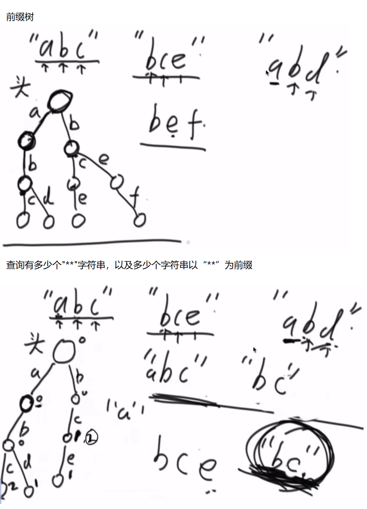

# <center>07.前缀树和题目<center>

# 1.前缀树

什么是前缀树，看下图就了解了



```java
public class Code_01_TrieTree {

	public static class TrieNode {
		public int path; // 有多少个字符串经过这个节点
		public int end;  // 有多少个字符串以这个节点结尾的
		public TrieNode[] nexts;

		public TrieNode() {
			path = 0;
			end = 0;
			nexts = new TrieNode[26]; // 26个字母，26条路
		}
	}

	public static class Trie {
		private TrieNode root;

		public Trie() {
			root = new TrieNode();
		}

		public void insert(String word) {
			if (word == null) {
				return;
			}
			char[] chs = word.toCharArray();
			TrieNode node = root;
			int index = 0;
			for (int i = 0; i < chs.length; i++) {
				index = chs[i] - 'a';
				if (node.nexts[index] == null) {
					node.nexts[index] = new TrieNode();
				}
				node = node.nexts[index];
				node.path++;
			}
			node.end++;
		}

		public void delete(String word) {
			if (search(word) != 0) {
				char[] chs = word.toCharArray();
				TrieNode node = root;
				int index = 0;
				for (int i = 0; i < chs.length; i++) {
					index = chs[i] - 'a';
					if (--node.nexts[index].path == 0) {
						node.nexts[index] = null;
						return;
					}
					node = node.nexts[index];
				}
				node.end--;
			}
		}

		public int search(String word) {
			if (word == null) {
				return 0;
			}
			char[] chs = word.toCharArray();
			TrieNode node = root;
			int index = 0;
			for (int i = 0; i < chs.length; i++) {
				index = chs[i] - 'a';
				if (node.nexts[index] == null) {
					return 0;
				}
				node = node.nexts[index];
			}
			return node.end;
		}

		public int prefixNumber(String pre) {
			if (pre == null) {
				return 0;
			}
			char[] chs = pre.toCharArray();
			TrieNode node = root;
			int index = 0;
			for (int i = 0; i < chs.length; i++) {
				index = chs[i] - 'a';
				if (node.nexts[index] == null) {
					return 0;
				}
				node = node.nexts[index];
			}
			return node.path;
		}
	}
}
```

