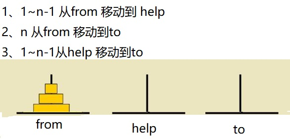
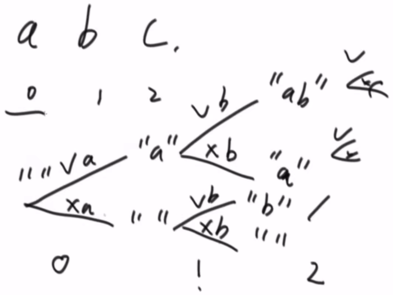
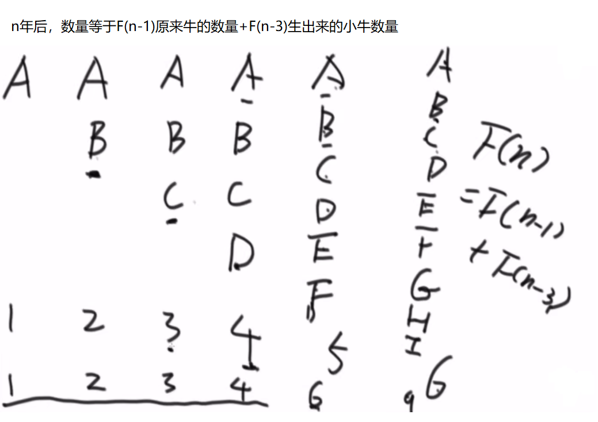

# <center>08.算法-递归和动态规划<center>

# 1.递归和动态规划

暴力递归：  
1. 把问题转化为规模缩小了的同类问题的子问题
2. 有明确的不需要继续进行递归的条件(base case)
3. 有当得到了子问题的结果之后的决策过程
4. 不记录每一个子问题的解

动态规划  
1. 从暴力递归中来
2. 将每一个子问题的解记录下来，避免重复计算
3. 把暴力递归的过程，抽象成了状态表达
4. 并且存在化简状态表达，使其更加简洁的可能

# 2.求n!的结果

```java
public class Code_01_Factorial {
	public static long getFactorial1(int n) {
		if (n == 1) {
			return 1L;
		}
		return (long) n * getFactorial1(n - 1);
	}

	public static long getFactorial2(int n) {
		long result = 1L;
		for (int i = 1; i <= n; i++) {
			result *= i;
		}
		return result;
	}
}
```

# 3.汉诺塔问题

打印n层汉诺塔从最左边移动到最右边的全部过程



```java
public class Code_02_Hanoi {
	public static void process(int N,String from,String to,String help){
		if(N==1){
			System.out.println("将第1个从"+from+"移动到"+to);
		}else{
			process(N-1,from,help,to);
			System.out.println("将第"+N+"个从"+from+"移动到"+to);
			process(N-1,help,to,from);
		}
	}
}
```

# 4.打印一个字符串的全部子序列，包括空字符串



```java
public class Code_03_Print_All_Subsquences {
    	public static void printAllSub(char[] str,int i,String res){
    		if(i == str.length){
    			System.out.println(res);
    			return;
    		}
    		printAllSub(str,i+1,res);
    		printAllSub(str,i+1,res+String.valueOf(str[i]));
    	}
}
```

# 5.母牛生母牛
母牛每年生一只母牛，新出生的母牛成长三年后也能每年生一只母牛，假设不会死。求N年后，母牛的数量。



```java
public class Code_05_Cow {
	public static int cow(int n) {
		if (n < 0) {
			return 0;
		}
		if (n <= 3) {
			return n;
		}
		return cow(n - 1) + cow(n - 3);
	}
}
```

# 6.题目
给你一个二维数组，二维数组中的每个数都是正数，要求从左上角走到右下角，每一步只能向右或者向下。沿途经过的数字要累
加起来。返回最小的路径和。

```java
public class Code_07_MinPath {
	public static int walk(int[][] matrix,int i,int j){
		if(i == matrix.length-1 && j == matrix[0].length-1){
			return matrix[i][j];
		}
		if(i == matrix.length - 1){
			return matrix[i][j]+walk(matrix,i,j+1);
		}
		if(j == matrix[0].length - 1){
			return matrix[i][j] + walk(matrix,i+1,j);
		}
		int rightPath = walk(matrix,i,j+1);  // 右边位置到右下角的最短距离
		int downPath = walk(matrix,i+1,j);   // 下边位置到右下角的最短距离
		return matrix[i][j]+Math.min(rightPath,downPath);
	}
}
```

# 7.题目
给你一个数组arr，和一个整数aim。如果可以任意选择arr中的数字，能不能累加得到aim，返回true或者false

```java
public class Code_08_Money_Problem {
	public static boolean isSum(int[] arr,int i,int sum,int aim){
		if(i == arr.length){
			return sum == aim;
		}
		return isSum(arr,i+1,sum,aim) || isSum(arr,i+1,sum+arr[i],aim);
	}
}
```
