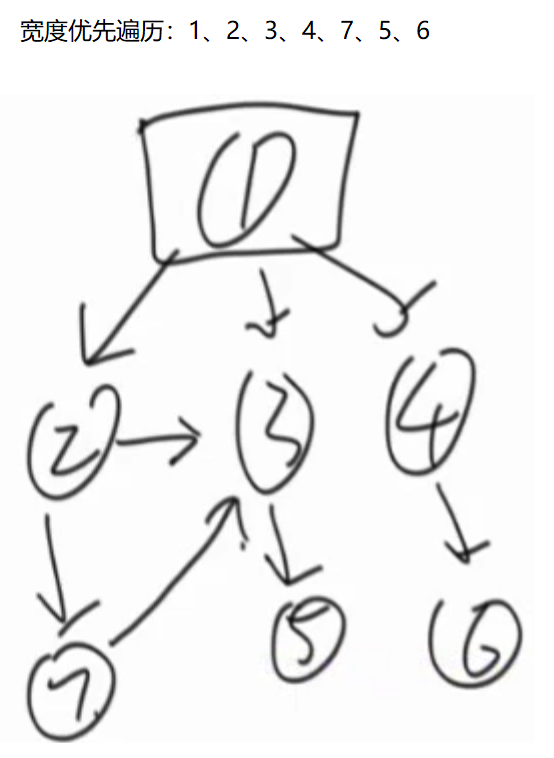

# <center>08.图<center>

# 1.图的存储方式

# 1.1. 邻接表
有向图的领接表示：


无向图的邻接表示法：


# 1.2. 邻接矩阵


# 1.3.其它表示法


```java
public class Node {
	public int value;
	public int in;
	public int out;
	public ArrayList<Node> nexts;
	public ArrayList<Edge> edges;

	public Node(int value) {
		this.value = value;
		in = 0;
		out = 0;
		nexts = new ArrayList<>();
		edges = new ArrayList<>();
	}
}

public class Edge {
	public int weight;
	public Node from;
	public Node to;

	public Edge(int weight, Node from, Node to) {
		this.weight = weight;
		this.from = from;
		this.to = to;
	}

}

public class Graph {
	public HashMap<Integer,Node> nodes;
	public HashSet<Edge> edges;

	public Graph() {
		nodes = new HashMap<>();
		edges = new HashSet<>();
	}
}


public class GraphGenerator {

	public static Graph createGraph(Integer[][] matrix) {
		Graph graph = new Graph();
		for (int i = 0; i < matrix.length; i++) {
			Integer weight = matrix[i][0];
			Integer from = matrix[i][1];
			Integer to = matrix[i][2];
			if (!graph.nodes.containsKey(from)) {
				graph.nodes.put(from, new Node(from));
			}
			if (!graph.nodes.containsKey(to)) {
				graph.nodes.put(to, new Node(to));
			}
			Node fromNode = graph.nodes.get(from);
			Node toNode = graph.nodes.get(to);
			Edge newEdge = new Edge(weight, fromNode, toNode);
			fromNode.nexts.add(toNode);
			fromNode.out++;
			toNode.in++;
			fromNode.edges.add(newEdge);
			graph.edges.add(newEdge);
		}
		return graph;
	}
}
```

# 2.宽度优先遍历

较近节点先遍历，远节点后遍历

1. 利用队列实现 
2. 从源节点开始依次按照宽度进队列，然后弹出 
3. 每弹出一个点，把该节点所有没有进过队列的邻接点放入队列 
4. 直到队列变空



```java
public class Code_01_BFS {

	public static void bfs(Node node) {
		if (node == null) {
			return;
		}
		Queue<Node> queue = new LinkedList<>();
		HashSet<Node> map = new HashSet<>();
		queue.add(node);
		map.add(node);
		while (!queue.isEmpty()) {
			Node cur = queue.poll();
			System.out.println(cur.value);
			for (Node next : cur.nexts) {
				if (!map.contains(next)) {
					map.add(next);
					queue.add(next);
				}
			}
		}
	}
}
```

# 3.深度优先遍历

1. 利用栈实现 
2. 从源节点开始把节点按照深度放入栈，然后弹出 
3. 每弹出一个点，把该节点下一个没有进过栈的邻接点放入栈 
4. 直到栈变空


```java
public class Code_02_DFS {

	public static void dfs(Node node) {
		if (node == null) {
			return;
		}
		Stack<Node> stack = new Stack<>();
		HashSet<Node> set = new HashSet<>();
		stack.add(node);
		set.add(node);
		System.out.println(node.value);
		while (!stack.isEmpty()) {
			Node cur = stack.pop();
			for (Node next : cur.nexts) {
				if (!set.contains(next)) {
					stack.push(cur);
					stack.push(next);
					set.add(next);
					System.out.println(next.value);
					break;
				}
			}
		}
	}
}
```

# 4.拓扑排序
`适用范围：要求有向图，且有入度为0的节点，且没有环`


```java
public class Code_03_TopologySort {

	// directed graph and no loop
	public static List<Node> sortedTopology(Graph graph) {
		HashMap<Node, Integer> inMap = new HashMap<>();
		Queue<Node> zeroInQueue = new LinkedList<>();
		for (Node node : graph.nodes.values()) {
			inMap.put(node, node.in);
			if (node.in == 0) {
				zeroInQueue.add(node);
			}
		}
		List<Node> result = new ArrayList<>();
		while (!zeroInQueue.isEmpty()) {
			Node cur = zeroInQueue.poll();
			result.add(cur);
			for (Node next : cur.nexts) {
				inMap.put(next, inMap.get(next) - 1);
				if (inMap.get(next) == 0) {
					zeroInQueue.add(next);
				}
			}
		}
		return result;
	}
}
```

# 5.kruskal算法 `适用范围：要求无向图`


```java
public class Code_04_Kruskal {

	// Union-Find Set
	public static class UnionFind {
		private HashMap<Node, Node> fatherMap;
		private HashMap<Node, Integer> rankMap;

		public UnionFind() {
			fatherMap = new HashMap<Node, Node>();
			rankMap = new HashMap<Node, Integer>();
		}

		private Node findFather(Node n) {
			Node father = fatherMap.get(n);
			if (father != n) {
				father = findFather(father);
			}
			fatherMap.put(n, father);
			return father;
		}

		public void makeSets(Collection<Node> nodes) {
			fatherMap.clear();
			rankMap.clear();
			for (Node node : nodes) {
				fatherMap.put(node, node);
				rankMap.put(node, 1);
			}
		}

		public boolean isSameSet(Node a, Node b) {
			return findFather(a) == findFather(b);
		}

		public void union(Node a, Node b) {
			if (a == null || b == null) {
				return;
			}
			Node aFather = findFather(a);
			Node bFather = findFather(b);
			if (aFather != bFather) {
				int aFrank = rankMap.get(aFather);
				int bFrank = rankMap.get(bFather);
				if (aFrank <= bFrank) {
					fatherMap.put(aFather, bFather);
					rankMap.put(bFather, aFrank + bFrank);
				} else {
					fatherMap.put(bFather, aFather);
					rankMap.put(aFather, aFrank + bFrank);
				}
			}
		}
	}

	public static class EdgeComparator implements Comparator<Edge> {

		@Override
		public int compare(Edge o1, Edge o2) {
			return o1.weight - o2.weight;
		}

	}

	public static Set<Edge> kruskalMST(Graph graph) {
		UnionFind unionFind = new UnionFind();
		unionFind.makeSets(graph.nodes.values());
		PriorityQueue<Edge> priorityQueue = new PriorityQueue<>(new EdgeComparator());
		for (Edge edge : graph.edges) {
			priorityQueue.add(edge);
		}
		Set<Edge> result = new HashSet<>();
		while (!priorityQueue.isEmpty()) {
			Edge edge = priorityQueue.poll();
			if (!unionFind.isSameSet(edge.from, edge.to)) {
				result.add(edge);
				unionFind.union(edge.from, edge.to);
			}
		}
		return result;
	}
}
```

# 6.prim算法 `适用范围：要求无向图`


```java
public class Code_05_Prim {

	public static class EdgeComparator implements Comparator<Edge> {

		@Override
		public int compare(Edge o1, Edge o2) {
			return o1.weight - o2.weight;
		}

	}

	public static Set<Edge> primMST(Graph graph) {
		PriorityQueue<Edge> priorityQueue = new PriorityQueue<>(
				new EdgeComparator());
		HashSet<Node> set = new HashSet<>();
		Set<Edge> result = new HashSet<>();
		for (Node node : graph.nodes.values()) {
			if (!set.contains(node)) {
				set.add(node);
				for (Edge edge : node.edges) {
					priorityQueue.add(edge);
				}
				while (!priorityQueue.isEmpty()) {
					Edge edge = priorityQueue.poll();
					Node toNode = edge.to;
					if (!set.contains(toNode)) {
						set.add(toNode);
						result.add(edge);
						for (Edge nextEdge : toNode.edges) {
							priorityQueue.add(nextEdge);
						}
					}
				}
			}
		}
		return result;
	}
}
```

# 7.Dijkstra算法 `适用范围：没有权值为负数的边`

思路：`以点出发，选择达到每个节点的总距离最短。`


```java
public class Code_06_Dijkstra {

	public static HashMap<Node, Integer> dijkstra1(Node head) {
		HashMap<Node, Integer> distanceMap = new HashMap<>();
		distanceMap.put(head, 0);
		HashSet<Node> selectedNodes = new HashSet<>();

		Node minNode = getMinDistanceAndUnselectedNode(distanceMap, selectedNodes);
		while (minNode != null) {
			int distance = distanceMap.get(minNode);
			for (Edge edge : minNode.edges) {
				Node toNode = edge.to;
				if (!distanceMap.containsKey(toNode)) {
					distanceMap.put(toNode, distance + edge.weight);
				}
				distanceMap.put(edge.to, Math.min(distanceMap.get(toNode), distance + edge.weight));
			}
			selectedNodes.add(minNode);
			minNode = getMinDistanceAndUnselectedNode(distanceMap, selectedNodes);
		}
		return distanceMap;
	}

	public static Node getMinDistanceAndUnselectedNode(HashMap<Node, Integer> distanceMap, 
			HashSet<Node> touchedNodes) {
		Node minNode = null;
		int minDistance = Integer.MAX_VALUE;
		for (Entry<Node, Integer> entry : distanceMap.entrySet()) {
			Node node = entry.getKey();
			int distance = entry.getValue();
			if (!touchedNodes.contains(node) && distance < minDistance) {
				minNode = node;
				minDistance = distance;
			}
		}
		return minNode;
	}

	public static class NodeRecord {
		public Node node;
		public int distance;

		public NodeRecord(Node node, int distance) {
			this.node = node;
			this.distance = distance;
		}
	}

	public static class NodeHeap {
		private Node[] nodes;
		private HashMap<Node, Integer> heapIndexMap;
		private HashMap<Node, Integer> distanceMap;
		private int size;

		public NodeHeap(int size) {
			nodes = new Node[size];
			heapIndexMap = new HashMap<>();
			distanceMap = new HashMap<>();
			this.size = 0;
		}

		public boolean isEmpty() {
			return size == 0;
		}

		public void addOrUpdateOrIgnore(Node node, int distance) {
			if (inHeap(node)) {
				distanceMap.put(node, Math.min(distanceMap.get(node), distance));
				insertHeapify(node, heapIndexMap.get(node));
			}
			if (!isEntered(node)) {
				nodes[size] = node;
				heapIndexMap.put(node, size);
				distanceMap.put(node, distance);
				insertHeapify(node, size++);
			}
		}

		public NodeRecord pop() {
			NodeRecord nodeRecord = new NodeRecord(nodes[0], distanceMap.get(nodes[0]));
			swap(0, size - 1);
			heapIndexMap.put(nodes[size - 1], -1);
			distanceMap.remove(nodes[size - 1]);
			nodes[size - 1] = null;
			heapify(0, --size);
			return nodeRecord;
		}

		private void insertHeapify(Node node, int index) {
			while (distanceMap.get(nodes[index]) < distanceMap.get(nodes[(index - 1) / 2])) {
				swap(index, (index - 1) / 2);
				index = (index - 1) / 2;
			}
		}

		private void heapify(int index, int size) {
			int left = index * 2 + 1;
			while (left < size) {
				int smallest = left + 1 < size && distanceMap.get(nodes[left + 1]) < distanceMap.get(nodes[left])
						? left + 1 : left;
				smallest = distanceMap.get(nodes[smallest]) < distanceMap.get(nodes[index]) ? smallest : index;
				if (smallest == index) {
					break;
				}
				swap(smallest, index);
				index = smallest;
				left = index * 2 + 1;
			}
		}

		private boolean isEntered(Node node) {
			return heapIndexMap.containsKey(node);
		}

		private boolean inHeap(Node node) {
			return isEntered(node) && heapIndexMap.get(node) != -1;
		}

		private void swap(int index1, int index2) {
			heapIndexMap.put(nodes[index1], index2);
			heapIndexMap.put(nodes[index2], index1);
			Node tmp = nodes[index1];
			nodes[index1] = nodes[index2];
			nodes[index2] = tmp;
		}
	}

	public static HashMap<Node, Integer> dijkstra2(Node head, int size) {
		NodeHeap nodeHeap = new NodeHeap(size);
		nodeHeap.addOrUpdateOrIgnore(head, 0);
		HashMap<Node, Integer> result = new HashMap<>();
		while (!nodeHeap.isEmpty()) {
			NodeRecord record = nodeHeap.pop();
			Node cur = record.node;
			int distance = record.distance;
			for (Edge edge : cur.edges) {
				nodeHeap.addOrUpdateOrIgnore(edge.to, edge.weight + distance);
			}
			result.put(cur, distance);
		}
		return result;
	}

}
```

